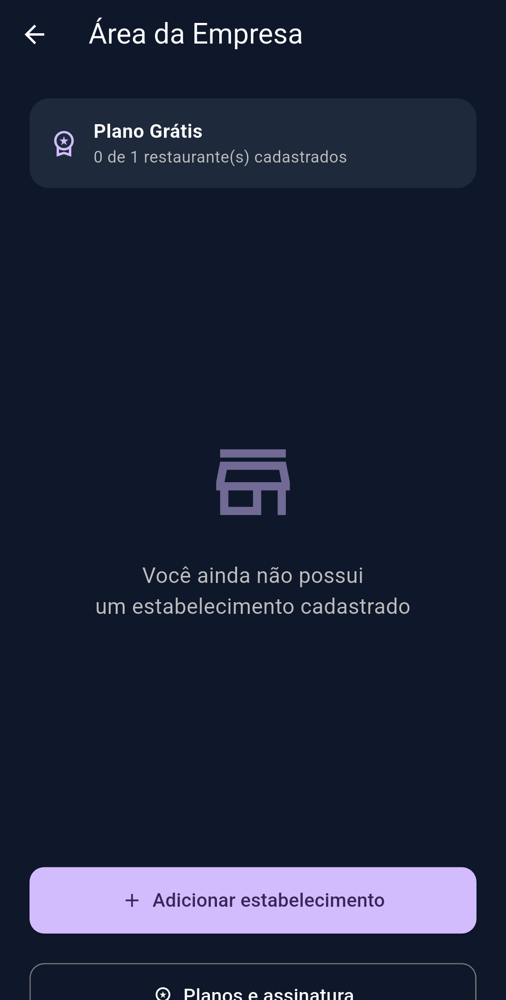
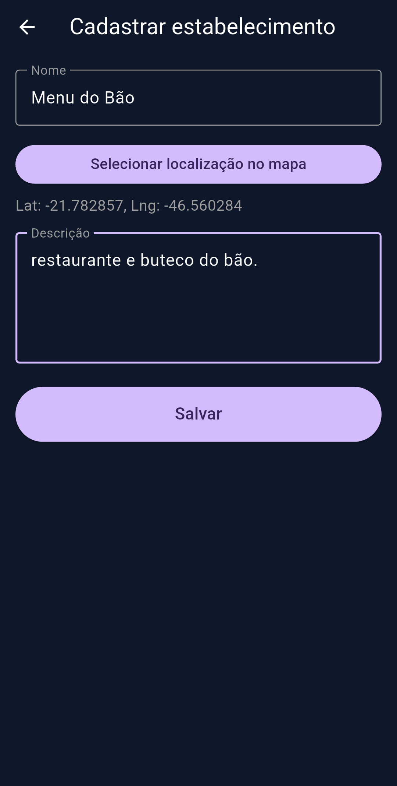
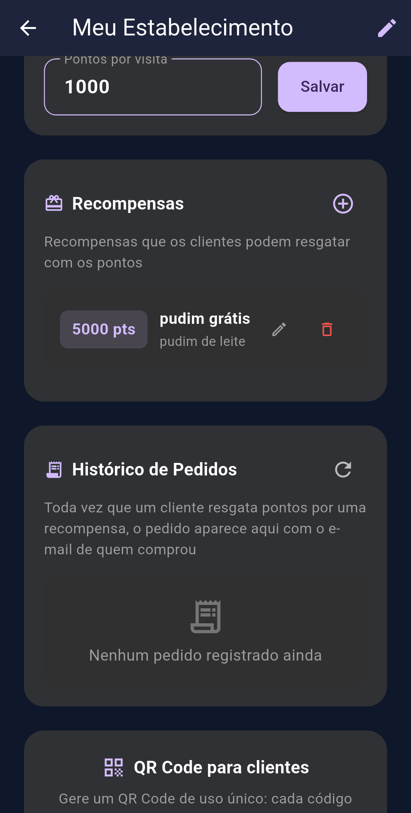
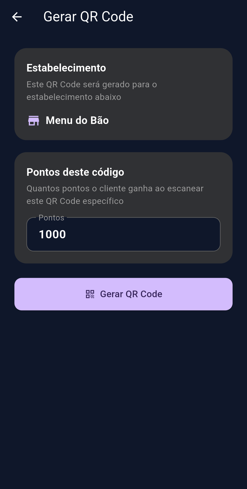

## Fluxo de Uso do App GRUDA AÍ!

O aplicativo possui dois fluxos principais, divididos entre o **Estabelecimento** (que gerencia o programa de fidelidade) e o **Cliente** (que acumula pontos e resgata recompensas).

### 1. Fluxo do Estabelecimento (Empresa)

O dono do estabelecimento gerencia todo o programa de fidelidade, desde o cadastro até a geração de pontos.

* **Acesso e Planos:** Login como "Empresa", escolha do plano de assinatura e cadastro do restaurante/boteco (com geolocalização).

  
  
  
  

* **Gestão do Estabelecimento:** Configuração de quantos pontos cada visita vale e criação das recompensas (ex: Pudim grátis por 5000 pts).

  
  

* **Geração de QR Code:** Criação de QR Codes de uso único para que os clientes possam escanear no local e pontuar.

  
  

---

### 2. Fluxo do Cliente

O cliente utiliza o app como uma carteira digital de fidelidade para todos os estabelecimentos parceiros.

* **Minhas Carteiras:** Visão geral de todos os locais onde o cliente possui pontos. Um botão central permite escanear o QR Code gerado pelo estabelecimento.

  

* **Resgate de Recompensas:** Tela de detalhes do estabelecimento mostrando o saldo atual (ex: 1000 pts) e as recompensas disponíveis para resgate.

  

