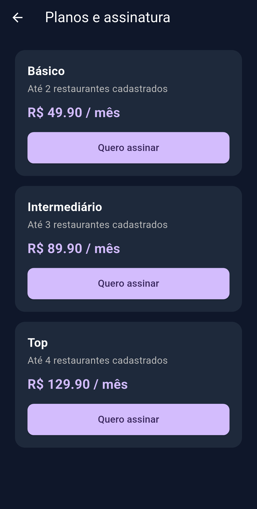
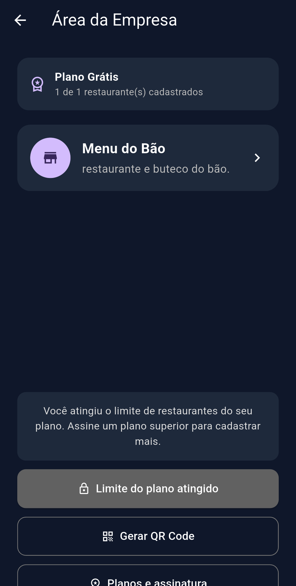

# Apresentação do Projeto: GRUDA AÍ!

## 1. O Problema e a Solução
Estabelecimentos físicos têm dificuldade em reter público de forma moderna, dependendo de cartões de papel que os clientes perdem. O **Gruda Aí!** digitaliza a fidelidade: empresas gerenciam seus próprios programas de pontos, e clientes centralizam suas recompensas em uma carteira digital segura via escaneamento de QR Code.

---

## 2. Demonstração e Fluxos

### Visão da Empresa (Gestão)
O estabelecimento escolhe seu plano, cadastra suas recompensas e gera QR Codes de uso único para validar os pontos de cada cliente no balcão.

  
  
  
  

### Visão do Cliente
O cliente utiliza a câmera para ler o QR Code, acumula pontos e acompanha seu progresso até o resgate das recompensas.

  
  

---

## 3. Arquitetura
O sistema não é apenas um protótipo visual. A base tecnológica garante que ele funcione de forma integrada e escalável:
*   **Front-end Mobile:** Flutter (Dart), garantindo performance nativa.
*   **Back-end / BaaS:** Firebase (Authentication e Firestore para banco de dados NoSQL em tempo real).
*   **Estrutura de Código:** Separação rígida de responsabilidades. A interface visual (`telas`), a regra de negócio (`funcionalidades`) e as chamadas ao banco de dados (`domain`) não se misturam.

---

## 4. Lições e Aprendizados
O desenvolvimento colaborativo destacou a importância de uma arquitetura bem definida. Ao isolar a integração do Firebase e a construção da UI nos estágios iniciais, a equipe evitou sobreposição de código. O principal custo de oportunidade evitado foi o retrabalho técnico, permitindo focar na lógica principal de geração e validação segura dos QR Codes.
